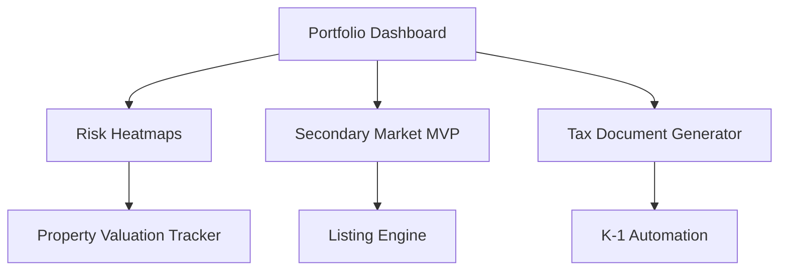

# iREVA: Real Estate Investment Platform

iREVA is a cutting-edge real estate investment platform designed to provide investors with a comprehensive ecosystem for property investments, portfolio management, and analytics.

## Overview

The iREVA platform enables fractional real estate investments with regulatory compliance, advanced portfolio analytics, and liquidity through a secondary market. The system is built with security, scalability, and user experience at its core.

## Key Features

- **Portfolio Dashboard**: Real-time analytics and performance tracking
- **Risk Heatmaps**: Visual representation of investment risk exposure
- **Secondary Market MVP**: Liquidity through peer-to-peer investment trading
- **Tax Document Generator**: Automated tax document creation (K-1, 1099)
- **Property Valuation Tracker**: Market-based valuation models
- **ESG Tracking**: Environmental, social, and governance metrics
- **Regulatory Compliance**: Automated investor verification and limits

## Architecture



## Technology Stack

- **Frontend**: React, TypeScript, Material UI, Tailwind CSS
- **Backend**: Express, Node.js, TypeScript
- **Database**: PostgreSQL with Drizzle ORM
- **Authentication**: JWT with role-based access control
- **Caching**: Redis for high-performance data access
- **Security**: Field-level encryption, distributed locks
- **Messaging**: WebSockets for real-time updates
- **Financial Integrity**: Event sourcing, circuit breakers

## Getting Started

### Clone the repository

```bash
git clone https://github.com/ireva-investments/core-platform.git
cd core-platform
```

### Install dependencies

```bash
npm install
```

### Set up environment variables

Copy the example environment file and update it with your settings:

```bash
cp .env.example .env
```

### Set up the database

```bash
npm run db:push
```

### Start the development server

#### Local Development
```bash
npm run dev
```

#### Replit Deployment
For Replit deployments, use the workflow command:
```bash
./workflow-command.sh
```

This uses a special port binding strategy to ensure Replit's workflow system detects the application correctly. The application will be accessible on port 5001 (not 5000).

For more details, see:
- [WORKFLOW_UPDATE_GUIDE.md](./WORKFLOW_UPDATE_GUIDE.md) - Detailed workflow configuration
- [PORT-CONFIGURATION.md](./PORT-CONFIGURATION.md) - Port setup and usage
- [QUICK-START-GUIDE.md](./QUICK-START-GUIDE.md) - Quick reference for developers
- [PRODUCTION-DEPLOYMENT-GUIDE.md](./PRODUCTION-DEPLOYMENT-GUIDE.md) - Production build and deployment guide

### Production Build

To create a production build of the iREVA platform:

```bash
# Run the production build workflow
./workflow-production-build.sh
```

This will create optimized production files in the `dist/` directory.

### Starting in Production Mode

To start the application in production mode:

```bash
# Run the production start workflow
./workflow-production-start.sh
```

The production server will run on port 5001.

## Core Modules

### 1. Investment Module
- Property browsing and investment
- ROI tracking and distribution
- Milestone-based escrow

### 2. Portfolio Analysis
- Geographic exposure analytics
- Asset class balancer
- Scenario analysis engine

### 3. Market Data Integration
- Automated valuation models
- Comparable property analysis
- Market trend visualization

### 4. Regulatory Compliance
- Investor accreditation verification
- Investment limit enforcement
- Jurisdiction-based restrictions

### 5. Document Management
- Automated tax document generation
- Contract management
- eSignature integration

## License

iREVA is proprietary software. © 2025 iREVA Investments Ltd. All rights reserved.# touch test
